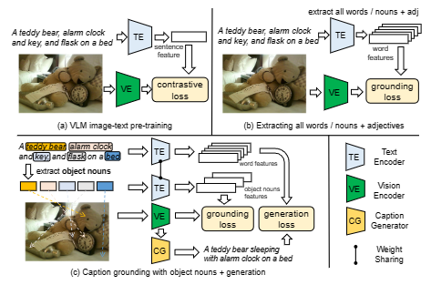
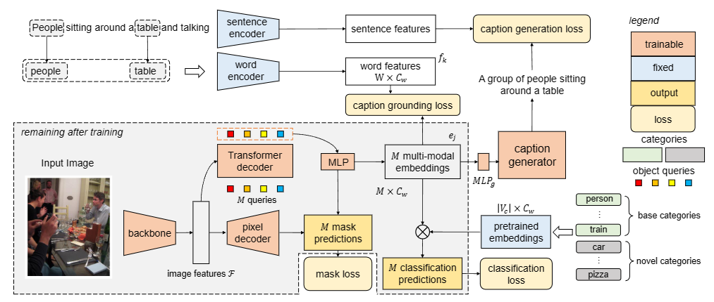
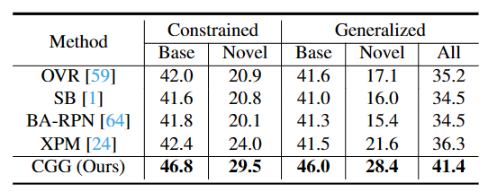
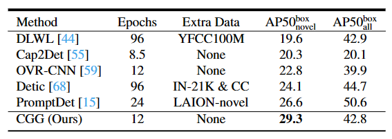
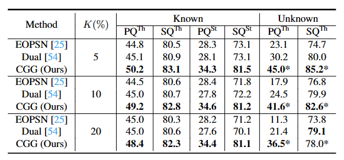

# CGG (ICCV 2023)
This repository contains the official implementation of the following paper:
> **Betrayed by Captions: Joint Caption Grounding and Generation for Open Vocabulary Instance Segmentation**<be>
> [Jianzong Wu](https://jianzongwu.github.io/)<sup>\*</sup>, [Xiangtai Li](https://lxtgh.github.io/)<sup>\*</sup>, [Henghui Ding](https://henghuiding.github.io/), [Xia Li](https://xialipku.github.io/), [Guangliang Cheng](https://scholar.google.com.hk/citations?user=FToOC-wAAAAJ&hl=zh-CN), [Yunhai Tong](https://scholar.google.com.hk/citations?user=T4gqdPkAAAAJ&hl=zh-CN), [Chen Change Loy](https://www.mmlab-ntu.com/person/ccloy/)<br>
> IEEE/CVF International Conference on Computer Vision (**ICCV**), 2023<br>

\[[Paper](https://arxiv.org/abs/2301.00805)\]
\[[Project](https://www.mmlab-ntu.com/project/betrayed_caption/index.html)\]

## :star: News
- *2023.7.19:* Our code is publicly available.

## Short Introduction

In this work, we focus on **instance-level open vocabulary segmentation**, intending to expand a segmenter for instance-wise novel categories without mask annotations.
We investigate a simple yet effective framework with the help of image captions, focusing on exploiting thousands of object nouns in captions to discover instances of novel classes. Rather than adopting pretrained caption models or using massive caption datasets with complex pipelines, we propose an end-to-end solution from two aspects: caption grounding and caption generation.
In particular, we devise a joint Caption Grounding and Generation (CGG) framework based on a Mask Transformer baseline. The framework has a novel grounding loss that performs explicit and implicit multi-modal feature alignments.
Moreover, we design a lightweight caption generation head to allow for additional caption supervision. We find that grounding and generation complement each other, significantly enhancing the segmentation performance for novel categories. 
We conduct extensive experiments on the COCO dataset with two settings: Open Vocabulary Instance Segmentation (OVIS) and Open Set Panoptic Segmentation (OSPS). The results demonstrate the superiority of our CGG framework over previous OVIS methods, achieving a large improvement of 6.8% mAP on novel classes without extra caption data. Our method also achieves over 15% PQ improvements for novel classes on the OSPS benchmark under various settings.



## Demo


## Overview



### :rocket: Highlights:
- **SOTA performance**: The proposed CGG achieves significant improvements on both open vocabulary instance segmenation and open-set panoptic segmentation in comparison with previous SOTA methods.
- **Data/memory effiency**: Our method achieves SOTA performances without training on large-scale image-text pairs, like CC3M. Besides, we do not use vision language models (VLMs) like CLIP to extract language features. We only use **BERT embeddings** for text features. As a result, our method has efficient data and memory effiencies compared with SOTA methods.

## Dependencies and Installation

1. Clone Repo

   ```bash
   git clone https://github.com/jianzongwu/betrayed-by-captions.git
   cd betrayed-by-captions
   ```

2. Create Conda Environment and Install Dependencies

   ```bash
    conda create -n cgg python=3.8
    conda activate cgg

    # install pytorch (according to your local GPU and cuda version)
    conda install pytorch==1.12.1 torchvision==0.13.1 torchaudio==0.12.1 cudatoolkit=11.6 -c pytorch -c conda-forge

    # build mmcv-full from source
    # This repo uses mmcv-full-1.7.1
    mkdir lib
    cd lib
    git clone git@github.com:open-mmlab/mmcv.git
    cd mmcv
    pip install -r requirements/optional.txt
    MMCV_WITH_OPS=1 pip install -e . -v

    # build mmdetection from source
    # This repo uses mmdet-2.28.2
    cd ..
    git clone git@github.com:open-mmlab/mmdetection.git
    cd mmdetection
    pip install -v -e .

    # build panopticapi from source
    cd ..
    git clone git@github.com/cocodataset/panopticapi.git
    cd panopticapi
    pip install -v -e .

    # install other dependencies
    cd ../..
    pip install -r requirements.txt

    ```

## Get Started
### Prepare pretrained models
Before performing the following steps, please download our pretrained models first.

We release the models for open vocabulary instance segmentation (OVIS), open vocabulary object detection (OVOD), and open-set panoptic segmentation (OSPS). For the details of OSPS, please refer to [this paper](https://arxiv.org/abs/2105.08336).

<table>
<thead>
  <tr>
    <th>Model</th>
    <th>:link: Download Links </th>
    <th>Task</th>
  </tr>
</thead>
<tbody>
  <tr>
    <td>CGG-COCO-Instances</td>
    <th>
       [<a href="https://drive.google.com/file/d/1oJAdfB1Ejhzx3TxwcBx9MCUZs4j9wf0v/view?usp=drive_link">Google Drive</a>] 
       [<a href="https://pan.baidu.com/s/1WwujrPnUGgW55VuilyGdmA?pwd=slsk 
">Baidu Disk</a>]
    </th>
    <th>OVIS & OVOD</th>
  </tr>
  <tr>
    <td>CGG-COCO-Panoptic</td>
    <th>
       [<a href="https://drive.google.com/file/d/1oJAdfB1Ejhzx3TxwcBx9MCUZs4j9wf0v/view?usp=drive_link">Google Drive</a>] 
       [<a href="https://pan.baidu.com/s/1WwujrPnUGgW55VuilyGdmA?pwd=slsk 
">Baidu Disk</a>]
    </th>
    <th>OSPS</a> </th>
  </tr>
</tbody>
</table>

Then, place the models to `chekpoints` directory.

The directory structure will be arranged as:
```
checkpoints
   |- README.md
   |- coco_instance_ag3x_1x.pth
   |- coco_panoptic_p20.pth
```

### Quick inference
We provide a [jupyter notebook](./notebooks/inference.ipynb) for inferencing our model on both OVIS and OVPS. Feel free to upload your own images to test our model's ability on various scenarios!

### Prepare datasets
<table>
<thead>
  <tr>
    <th>Dataset</th>
    <th>COCO</th>
    <th>ADE20K</th>
  </tr>
</thead>
<tbody>
  <tr>
    <td>Details</td>
    <td>For training and evaluation</td>
    <td>For evaluation</td>
  <tr>
    <td>Download</td>
    <td> <a href="https://cocodataset.org/">Official Link</a></td>
    <td> <a href="https://data.csail.mit.edu/places/ADEchallenge/ADEChallengeData2016.zip">ADEChanllengeData2016</a></td>
  </tr>
</tbody>
</table>

For the COCO dataset, we use the 2017 version images and annotations. Please download train2017 and val2017 images. For annotatoins, we use `captions_train2017.json`, `instances_train/test2017.json`, and `panoptic_train/val2017.json`.

For the evaluation on ADE20K dataset, we use the MIT Scene Parsing Benchmark validation set, which contains 100 classes. Please download the converted COCO-format annotation file form [here]() and put it in the `annotations` folder.

Please put all the datasets to the `data` directory. The `data` directory structure will be arranged as:
```
data
    |- ade20k
        |- ADEChallengeData2016
            |- annotations
                |- train
                |- validation
                |- ade20k_instances_val.json
            |- images
                |- train
                |- validation
            |- objectsInfo150.txt
            |- sceneCategories.txt
    |- coco
        |- annotations
            |- captions_train2017.json
            |- instances_train2017.json
            |- instances_val2017.json
            |- panoptic_train2017.json
            |- panoptic_val2017.json
        |- train2017
        |- val2017
```

### Evaluation
We provide evaluation code for the COCO dataset.

Run the following commands for evaluation on OVIS.

Run on single GPU:
``` shell
python tools/test.py \
    configs/instance/coco_b48n17.py \
    checkpoints/coco_instance_ag3x_1x.pth \
    --eval bbox segm
```

Run on multiple GPUs:
``` shell
bash ./tools/dist_test.sh \
    configs/instance/coco_b48n17.py \
    checkpoints/coco_instance_ag3x_1x.pth \
    8 \
    --eval bbox segm
```

Run the following commands for evaluation on OSPS.

Run on single GPU:
``` shell
python tools/test.py \
    configs/openset_panoptic/coco_panoptic_p20.py \
    checkpoints/coco_panoptic_p20.pth \
    --eval bbox segm
```

Run on multiple GPUs:
``` shell
bash ./tools/dist_test.sh \
    configs/openset_panoptic/coco_panoptic_p20.py \
    checkpoints/coco_panoptic_p20.pth \
    8 \
    --eval bbox segm
```

You will get the scores as paper reported. The output will also be saved in `work_dirs/{config_name}`.

### Training
Our model first pre-trains in an class-agnostic manner. The pre-train configs are provided in [`configs/instance/coco_ag_pretrain_3x`](./configs/instance/coco_ag_pretrain_3x) (for OVIS) and [`configs/openset_panoptic/p{5/10/20}_ag_pretrain`](./configs/openset_panoptic) (for OSPS).

Run the following commands for class-agnotic pre-training.

Run on single GPU:
``` shell
# OVIS
python tools/train.py \
    configs/instance/coco_ag_pretrain_3x.py
# OSPS
python tools/train.py \
    configs/openset_panoptic/p20_ag_pretrain.py
```

Run on multiple GPUs:
``` shell
# OVIS
bash ./tools/dist_train.sh \
    configs/instance/coco_ag_pretrain_3x.py \
    8
# OSPS
bash ./tools/dist_train.sh \
    configs/openset_panoptic/p20_ag_pretrain.py \
    8
```

The pre-training on OVIS takes 36 epochs and may need a long time. Here we provide downloads for the class-agnostic pre-trained models.

<table>
<thead>
  <tr>
    <th>Model</th>
    <th>:link: Download Links </th>
    <th>Task</th>
  </tr>
</thead>
<tbody>
  <tr>
    <td>CGG-instance-pretrain</td>
    <th>
       [<a href="https://drive.google.com/file/d/1oJAdfB1Ejhzx3TxwcBx9MCUZs4j9wf0v/view?usp=drive_link">Google Drive</a>] 
       [<a href="https://pan.baidu.com/s/1WwujrPnUGgW55VuilyGdmA?pwd=slsk 
">Baidu Disk</a>]
    </th>
    <th>OVIS & OVOD</th>
  </tr>
  <tr>
    <td>CGG-panoptic-pretrain</td>
    <th>
       [<a href="https://drive.google.com/file/d/1oJAdfB1Ejhzx3TxwcBx9MCUZs4j9wf0v/view?usp=drive_link">Google Drive</a>] 
       [<a href="https://pan.baidu.com/s/1WwujrPnUGgW55VuilyGdmA?pwd=slsk 
">Baidu Disk</a>]
    </th>
    <th>OSPS</a> </th>
  </tr>
</tbody>
</table>

The directory structure will be arranged as:
```
pretrained
   |- README.md
   |- class_ag_pretrained_3x.pth
   |- panoptic_p20_ag_pretrain.pth
```

If you perform the class-agnostic pre-training by yourself, please rename the pre-trained model saved in `work_dirs` and save them into the `pretrained` folder as the directory structure above. The training configs will load the pre-trained weights.

After pre-training, the open vocabulary training configs are provided in [`configs/instance_coco_b48n17`](./configs/instance_coco_b48n17) (for OVIS) and [`configs/openset_panoptic/coco_panoptic_p{5/10/20}`](./configs/openset_panoptic) (for OSPS).

Run one of the following commands for training.

Run on single GPU:
``` shell
# OVIS
python tools/train.py \
    configs/instance/coco_b48n17.py
# OSPS
python tools/train.py \
    configs/openset_panoptic/coco_panoptic_p20.py
```

Run on multiple GPUs:
``` shell
# OVIS
bash ./tools/dist_train.sh \
    configs/instance/coco_b48n17.py \
    8
# OSPS
bash ./tools/dist_train.sh \
    configs/openset_panoptic/coco_panoptic_p20.py \
    8
```

The output will be saved in `work_dirs/{config_name}`.

## Results  

### Quantitative results

Results on OVIS:



Results on OVIS:



Results on OVIS:



## Citation

   If you find our repo useful for your research, please consider citing our paper:

   ```bibtex
   @article{wu2023betrayed,
      title={Betrayed by captions: Joint caption grounding and generation for open vocabulary instance segmentation},
      author={Wu, Jianzong and Li, Xiangtai and Ding, Henghui and Li, Xia and Cheng, Guangliang and Tong, Yunhai and Loy, Chen Change},
      journal={arXiv preprint arXiv:2301.00805},
      year={2023}
    }
   ```
## Contact

If you have any question, please feel free to contact us via `jzwu@stu.pku.edu.cn` or `xiangtai.li@ntu.edu.sg`.

## License
Licensed under a [Creative Commons Attribution-NonCommercial 4.0 International](https://creativecommons.org/licenses/by-nc/4.0/) for Non-commercial use only.
Any commercial use should get formal permission first.

## Acknowledgement

This repository is maintained by [Jianzong Wu]() and [Xiangtai Li](https://lxtgh.github.io/).

This code is based on [MMDetection](https://github.com/open-mmlab/mmdetection).
